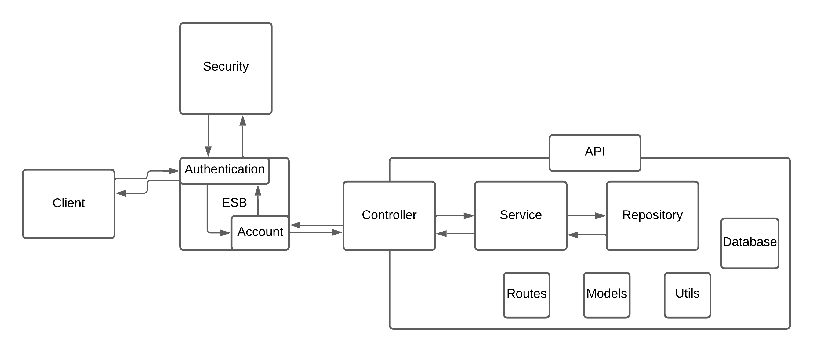

---

# 📌 FinBridge

This project is an attempt to simulate Open Finance and put into practice some concepts that were recently studied.

---

## 🚀 Features

* 🔍 Exchange customer data between banks

---

## 🛠️ Technologies Used

* Language: **TypeScript**
* Framework: **Node.js**
* Database: **MongoDB**
* Others:
  * IBM App Connect
  * Git

---

## 📂 Project Structure

```fin-bridge
├── docs/
│   ├── arch/
├── src/
│   ├── controllers/
│   ├── services/
│   ├── models/
│   ├── databases/
│   ├── utils/
│   ├── routes/
│   ├── index.ts
│   └── app.ts
├── README.md
└── package.json
```

---

### Prerequisites

* Git
* Node.js
* Npm

---

## 📸 Screenshots

> 

---

## 📄 License

This project is licensed under the **MIT License**.
See the `LICENSE` file for more details.

---

## 👤 Author

* Name: **bacate**
* GitHub: [@bacate](https://github.com/bacate)
* LinkedIn: *[https://www.linkedin.com/in/gabriel-olra/](https://www.linkedin.com/in/gabriel-olra/)*

---

## 🤝 Contributing

Contributions are welcome!
Feel free to open an *issue* or submit a *pull request*.

---